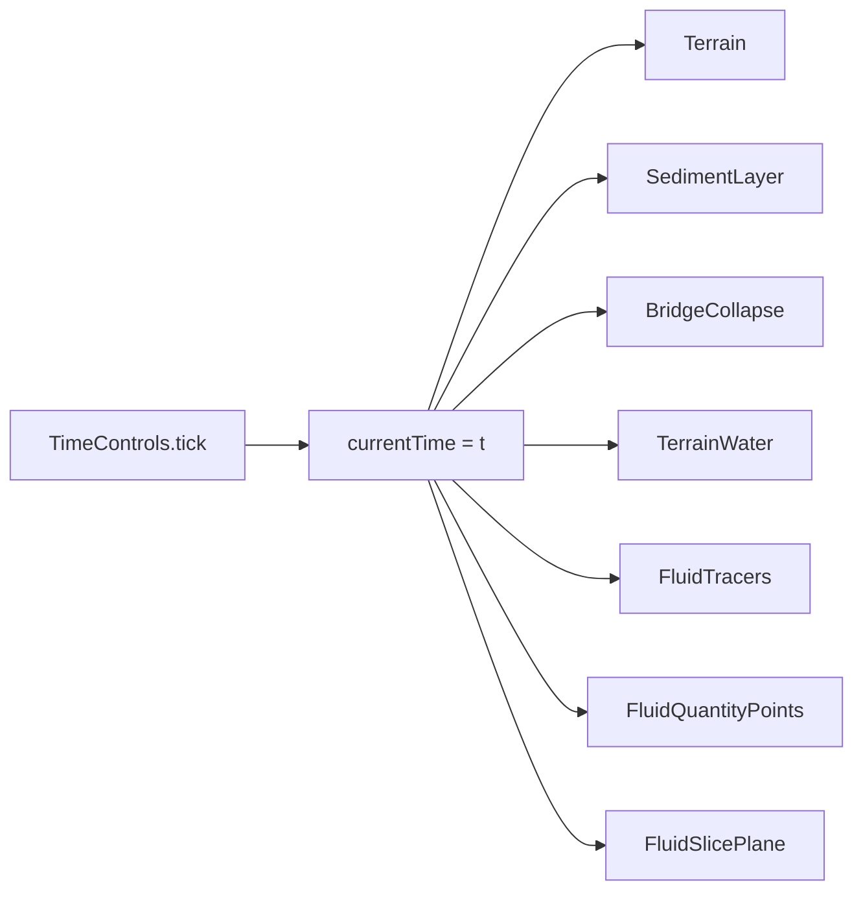

# FLOW-3D 교량 세굴 3D 대시보드
## 실데이터 CSV 연동과 유체·하상 통합 시각화

> **한 줄 요약**  
> 합성 데모에서 한 걸음 더 — FLOW-3D CSV를 브라우저에서 직접 파싱하고,  
> 하상·수면·유체장·세굴 변화량을 **단일 시간축** 위에 겹쳐 보여주는 3D 대시보드를 완성했다.

---

## 들어가며

지난 스프린트에서 Three.js 기반의 교량 세굴 3D 대시보드 골격을 만들었다.  
지형 애니메이션, 교각 붕괴 시뮬레이션, 합성 유체장까지 — **데모는 돌아갔다.**

오늘의 목표는 명확했다.

| Before | After |
|--------|-------|
| 합성 데이터만 시각화 | **FLOW-3D CSV 직접 업로드** |
| 수평 슬라이스 중심 유체 표현 | **지형 위 수면 + 추적 입자 + 3D 점군** |
| 파라미터 패널 하나 | **실험 조건 / 유체 / CSV / 시각 설정** 역할 분리 |
| HUD 텍스트 오버레이 | **Dock 패널 + 글래스 UI** 로 정보 재구성 |

React 없이 **Vite + TypeScript + Three.js** 순수 DOM 조합으로,  
ParaView 없이도 브라우저에서 FLOW-3D 결과를 탐색할 수 있는 환경을 목표로 했다.

---

## 오늘의 성과 한눈에

```
┌─────────────────────────────────────────────────────────────┐
│  CSV 업로드 (3종 자동 감지)                                  │
│    ├─ terrain + frames + meta.json                          │
│    ├─ FLOW-3D 다변수 블록 CSV                               │
│    └─ x·y·z 좌표 + ux/vy/vz/scrdif …                        │
├─────────────────────────────────────────────────────────────┤
│  시각화 모듈 확장                                            │
│    ├─ TerrainWater   — GLSL 수면 + 유체량 컬러맵            │
│    ├─ FluidTracers   — 유속장 추적 입자 (1,400개)           │
│    ├─ FluidQuantityPoints — 최대 80K 3D 점군               │
│    └─ SedimentLayer  — 세굴공 아래 퇴적층                   │
├─────────────────────────────────────────────────────────────┤
│  좌표·물리량 통합                                            │
│    ├─ fluidWorld.ts — 지형 ↔ 유체 격자 정렬                 │
│    ├─ scrdif 주입 — 세굴 ΔZ → 유체 스칼라                   │
│    └─ experiment.ts — FLOW-3D 실험 수조 치수 단일 소스       │
├─────────────────────────────────────────────────────────────┤
│  UI 리디자인 + 테스트                                        │
│    ├─ 좌/우 Dock 글래스 패널, 유입→유출 방향 배지            │
│    ├─ CsvDataPreviewModal — 파싱 전·후 데이터 미리보기       │
│    └─ Vitest 17+ 스위트 (CSV 파서, fluidWorld, TerrainWater…) │
└─────────────────────────────────────────────────────────────┘
```

---

## 1. CSV 업로드 — 서버 없이 브라우저에서 FLOW-3D 결과 읽기

### 1.1 통합 로더 `loadCsvDashboard`

업로드된 파일 형식을 **자동 감지**하는 단일 진입점을 만들었다.

```typescript
// src/data/loadCsvDashboard.ts
export async function loadCsvDashboard(files, options): Promise<CsvDashboardLoadResult> {
  const isXyz = await isFlow3dXyzCsv(primary);
  const isFlow3d = !isXyz && (await isFlow3dVariableCsv(primary));

  if (isXyz)       return parseFlow3dXyzCsv → buildSeriesFromFlow3dVariables;
  if (isFlow3d)    return parseFlow3dVariableCsv → buildSeriesFromFlow3dVariables;
  else             return loadScourFromCsvFiles;  // terrain + frames
}
```

| 형식 | 파일 예시 | 처리 |
|------|-----------|------|
| **격자 시계열** | `terrain.csv`, `frame_*.csv`, `meta.json` | 하상 베이스 + Δelevation 프레임 |
| **FLOW-3D 다변수** | 변수명·단위 헤더 + 수치 블록 | `ux/vy/vz`, `tke`, `scrdif` … |
| **x·y·z 좌표** | 좌표열 + 물리량열 | 비정형 격자 → 3D 점군 시각화 |

### 1.2 메인 스레드를 살리는 파싱 전략

GB급 CSV도 UI가 멈추지 않도록 설계했다.

```text
ReadableStream
    │
    ├─ 64줄마다 yieldToMain()     ← 메인 스레드 양보
    ├─ AbortSignal                ← 사용자 취소 즉시 중단
    ├─ csvProgress.ts             ← 다중 파일 가중 진행률
    └─ Float32Array pre-alloc     ← 힙 단편화 방지
```

`CsvUploadPanel`은 파싱 중 **전체 화면 블로커 + 진행률 바**를 띄우고,  
완료 후 `CsvDataPreviewModal`에서 격자 통계·미리보기 테이블을 확인할 수 있다.

### 1.3 FLOW-3D 변수 레지스트리

한글·영문 혼재 헤더도 인식하도록 변수 정의 테이블을 두었다.

```typescript
// src/data/flow3dVariableDefs.ts
export const FLOW3D_VARIABLE_DEFS = {
  ux:     { id: 'ux',     label: 'x방향 유속', category: 'velocity' },
  scrdif: { id: 'scrdif', label: '초기 지반 대비 세굴/퇴적 변화량', category: 'scour' },
  // tke, dtke, mhyfd, shrvel, davel, ofvel …
};
```

---

## 2. 좌표 통합 — `fluidWorld.ts`

지형·유체·수면·교각이 **같은 월드 좌표**를 쓰도록 정렬 레이어를 추가했다.

```text
좌표 규약
  X = 흐름 방향 (유입 −X → 유출 +X)
  Y = 연직 (퇴적물 표면 = 0)
  Z = 폭

alignFluidSeriesToTerrain()
  → CSV 유체 격자 origin을 지형 도메인 중심에 맞춤

waterSurfaceElevation(terrain, waterDepth)
  → 하상 표고 + 수심 = 수면 절대 높이

sampleFluidVelocityAtWorld(x, y, z)
  → FluidTracers 입자 이동에 사용
```

CSV 실데이터를 올리면 `coordinateFluid = true` 로  
`FluidQuantityPoints` stride·가시성이 자동 조정된다.

---

## 3. 시각화 모듈 — 하상·수면·유체를 한 화면에

모든 모듈은 기존 규약 **`updateAtTime(t)`** 을 그대로 따른다.



### 3.1 TerrainWater — 지형 위 GLSL 수면

수평 슬라이스 대신, **습윤(wet) 정점**에만 파형을 적용하는 커스텀 셰이더.

```glsl
// Vertex: +X(하류) 방향으로 이동하는 Gerstner-like 파형
float downstream = pos.x - uTime * 0.55;
pos.y += (w1 + w2 + w3) * uWaveAmp * aWet;

// Fragment: DataTexture(유체량) + Fresnel-like 가장자리
```

- 지형 고도 + 세굴 ΔZ + 수면 높이 동기화
- `velocityX/Y/Z`, `scrdif` 등 선택 물리량을 수면에 컬러맵
- 기본 유체 표현의 **주력 레이어** (슬라이스·화살표는 보조)

### 3.2 FluidTracers — 유속장 추적 입자

약 **1,400개** 입자가 매 프레임 유속을 따라 이동한다.

```typescript
// src/modules/FluidTracers.ts
const DEFAULT_COUNT = 1400;
const ADVECTION_BOOST = 3.5;  // 시각적 가독성을 위한 속도 배율
```

- `LineSegments` 로 스트릭(streak) 표현
- 수면 아래·지형 위에서만 생존, 정체 시 재배치
- `FluidControls`에서 토글 가능

### 3.3 FluidQuantityPoints — x·y·z CSV 3D 점군

좌표형 FLOW-3D CSV 전용. 최대 **80,000점** `Points` 렌더링.

```typescript
const MAX_POINTS = 80_000;
// stride 자동 조정 → draw call 1회, GPU 부담 제어
```

### 3.4 SedimentLayer — 퇴적층

세굴로 파인 하상 **아래** 모래층을 표현한다.

- pit 벽면이 bed 표고를 따라 내려가는 동적 메쉬
- `sedimentThickness` 파라미터와 `experiment.ts` 실측치(0.127 m) 연동

### 3.5 scrdif — 세굴 변화량을 유체 스칼라로

합성 데이터에서는 지형 Δelevation을 유체 격자에 **`scrdif` 스칼라**로 주입한다.

```typescript
injectScrdifFromScour(fluidSeries, scourSeries, waterLevelY);
// → 수면 근처 슬라이스에 세굴/퇴적 변화량 매핑
// → TerrainWater·FluidControls 범례에 동일하게 표시
```

---

## 4. 실험 조건 모델링 — `experiment.ts`

FLOW-3D 실험 수조 치수를 **단일 진실 소스(Single Source of Truth)** 로 분리했다.

```typescript
export const FLUME = {
  tank: { lengthX: 1.116, widthZ: 0.456, heightY: 0.427 },
  sedimentThicknessY: 0.127,
  waterDepthM: 0.15,
  totalTimeSeconds: 1800,
  structure: { diameterM: 0.1, permeability: '불투과성' },
  terrainCellSize: 0.01,
  fluidCellSize: 0.02,
};
```

`SimParams` → `paramsToFlumeGeometry()` → 격자 해상도·교각 위치·프레임 간격이 모두 파생된다.  
`ExperimentInfoPanel`에서 슬라이더로 조절 후 **380ms 디바운스** 또는 "적용" 버튼으로 `buildSimState()` 핫 스왑.

---

## 5. UI 리디자인 — Dock 패널 + 글래스 크롬

### 5.1 패널 역할 분리

| 패널 | 위치 | 역할 |
|------|------|------|
| `ExperimentInfoPanel` | 좌 Dock | 수조·구조물·세굴 파라미터 |
| `FluidControls` | 좌 Dock | u/v/w/scrdif, 슬라이스·트레이서·점군 |
| `CsvUploadPanel` | 좌 Dock | CSV/폴더 업로드, 진행률, 취소 |
| `DashboardCustomizePanel` | 우 Dock | 배경색, 유체 불투명도 (즉시 반영) |
| `TimeControls` | 하단 | 재생·스크럽·속도 |
| `FlowDirectionBadge` | 캔버스 | 유입(−X) → 유출(+X) 방향 안내 |

### 5.2 디자인 토큰

```css
#app {
  --panel-bg: rgba(12, 28, 48, 0.82);
  --accent: #7ec8e3;
  --radius-panel: 10px;
  --dock-left-w: min(248px, 28vw);
  --dock-right-w: min(268px, 30vw);
}
```

- 다크 네이비 배경 `#0b1d33`
- 반투명 글래스 패널 + 시안 액센트
- 스크롤바 숨김, 휠 스크롤 유지
- 파싱 중 전체 화면 블로커로 UX 피드백

### 5.3 제거·정리

- `HudOverlay`, `MetadataPanel` 삭제 → Dock 패널로 정보 흡수
- `SimParamPanel` → `ExperimentInfoPanel` + `FluidControls`로 역할 분담

---

## 6. 아키텍처 — 변하지 않은 핵심 규약

오늘 추가된 모듈도 **기존 설계 원칙**을 그대로 따른다.

```typescript
interface SimState {
  terrain: Terrain;
  sedimentLayer: SedimentLayer;
  terrainWater: TerrainWater;
  tracers: FluidTracers;
  fluidPoints: FluidQuantityPoints;
  // …
  dispose(): void;  // GPU 리소스 + 이벤트 리스너 정리
}
```

```text
데이터 소스 추상화
  SyntheticScourSource  ─┐
  ManifestSource        ─┼─► ScourSeries / FluidSeries ─► updateAtTime(t)
  loadCsvDashboard      ─┘

파라미터 변경
  ExperimentInfoPanel.onApply
    → buildSimState(newParams)
    → oldSim.dispose()
    → loop 재연결
```

---

## 7. 테스트

Vitest + jsdom으로 **파서·좌표·색상·모듈** 단위 검증을 추가했다.

| 테스트 파일 | 검증 대상 |
|-------------|-----------|
| `parseFlow3dVariableCsv.test.ts` | FLOW-3D 다변수 블록 파싱 |
| `parseFlow3dXyzCsv.test.ts` | x·y·z 좌표 CSV |
| `loadScourFromCsvFiles.test.ts` | terrain + frames 분류 |
| `streamGridCsv.test.ts` | 스트리밍 격자 파서 |
| `fluidWorld.test.ts` | 좌표 변환·정렬 |
| `fluidQuantityColor.test.ts` | 물리량별 컬러맵 |
| `TerrainWater.test.ts` | 수면 모듈 lifecycle |
| `FluidTracers.test.ts` | 추적 입자 초기화 |
| `injectScrdifFluid.test.ts` | scrdif 주입 |
| `simParams.test.ts` | 프레임 간격 계산 |

```bash
npm test        # vitest run
npm run dev     # 로컬 개발
npm run build   # tsc + vite build
```

---

## 8. 성능 고려사항

| 영역 | 기법 | 효과 |
|------|------|------|
| CSV 파싱 | `yieldToMain()` 64줄마다 | UI 프리즈 방지 |
| 유체 점군 | stride + MAX 80K | draw call 1회 |
| 화살표 | `InstancedMesh` | 수천 개 → 2 draw call |
| 수면 | DataTexture 96×96 cap | GPU 메모리 상한 |
| 렌더 | `setPixelRatio(min(dpr, 2))` | Retina 부담 절반 |

---

## 9. 오늘 배운 것

1. **형식 자동 감지 단일 로더** — 업로드 UX를 위해 3종 CSV를 하나의 API로 통합
2. **`fluidWorld` 좌표 레이어** — 지형·유체·수면 정렬 없이는 "겹쳐 보이기"가 불가능
3. **수면 = 주력, 슬라이스 = 보조** — 지형 위 GLSL 수면이 직관성이 훨씬 높음
4. **scrdif 브릿지** — 세굴 ΔZ와 유체 스칼라를 연결해 한 범례에서 비교
5. **Disposable + SimState 핫 스왑** — CSV 로드·파라미터 변경 모두 메모리 안전
6. **React 없이도 Dock UI** — Three.js lifecycle과 DOM 패널 lifecycle 분리가 핵심

---

## 10. 다음 스텝

- [ ] Web Worker CSV 파싱 — 메인 스레드 완전 분리
- [ ] Backend presigned URL — GB 파일 스트리밍 다운로드
- [ ] glTF export — 특정 시간 프레임 메쉬 내보내기
- [ ] Prometheus + Grafana — 운영 메트릭

---

## 마치며

오늘 작업으로 이 프로젝트는 **"데모가 돌아가는 3D 뷰어"** 에서  
**"FLOW-3D 결과를 브라우저에서 직접 탐색하는 시각화 플랫폼"** 으로 한 단계 올라섰다.

합성 데이터로 검증한 `updateAtTime(t)` 규약 위에  
CSV 파이프라인·수면 셰이더·추적 입자·좌표 정렬을 얹었고,  
UI도 Dock 글래스 패널로 정리했다.

수 GB CSV의 마지막 mile — **연구자가 브라우저만 열면 세굴 진행을 볼 수 있는 그 지점** — 을 향해 가고 있다.

---

*Bridge Scour 3D Dashboard · Vite + TypeScript + Three.js · 2026-07-07*
