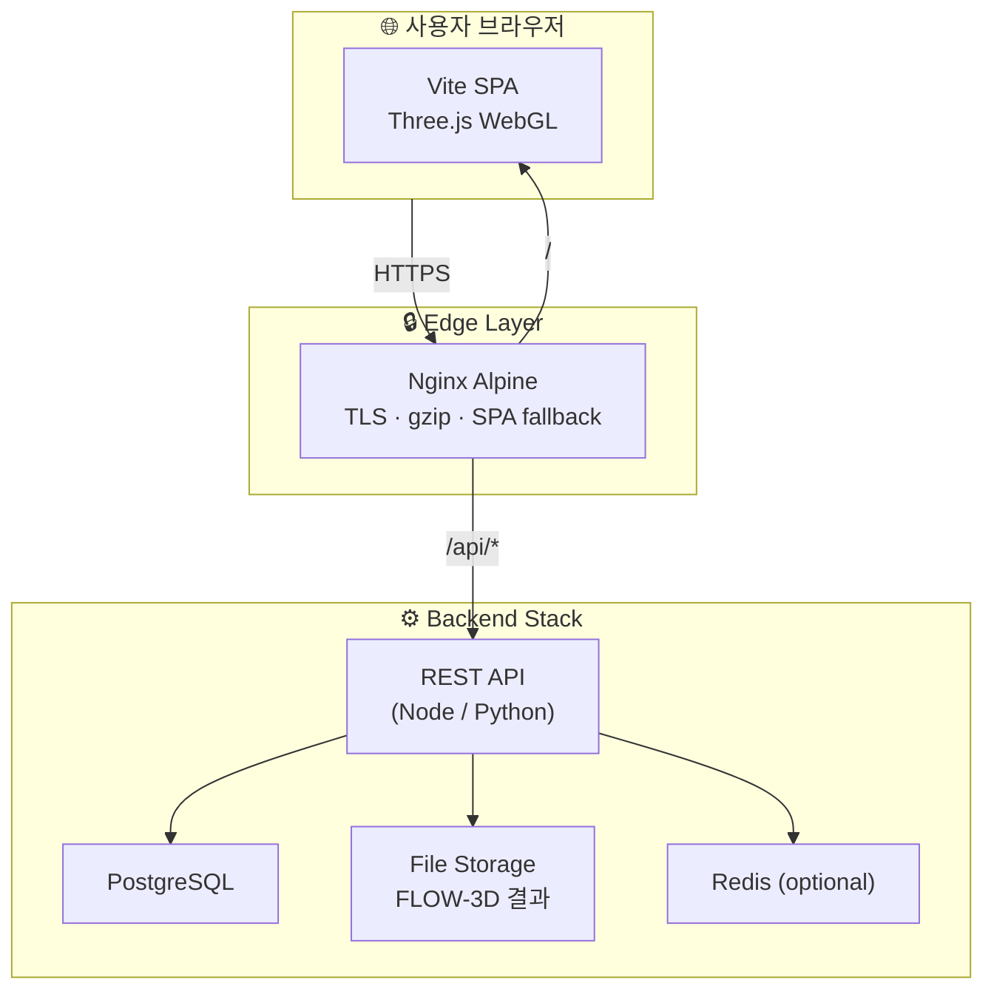

---

## title: "FLOW-3D 교량 세굴 3D 대시보드 — 브라우저에서 돌아가는 수치해석 시각화 엔진"
subtitle: "Three.js · TypeScript · 대용량 CSV 스트리밍 · 실시간 붕괴 시뮬레이션"
date: 2026-07-02
tags: [Three.js, TypeScript, FLOW-3D, Bridge Scour, WebGL, Data Visualization]
reading_time: 18 min
author: "[████████] 연구팀"


# FLOW-3D 교량 세굴 3D 대시보드

수치해석 결과를 브라우저에서 직접 탐색하는 WebGL 기반 시각화 플랫폼.  
하상 변화, 유체장, 교각 안전도를 **단일 시간축**으로 동기화합니다.

Three.js 0.169TypeScript StrictVite 5VitestDocker + NginxZero UI Framework


109

TypeScript 모듈

17

단위 테스트 스위트

80K

최대 유체 포인트

1

updateAtTime(t) 규약


**민감 정보 안내** — 본 문서의 배포 서버 주소, 기관명, 내부 프로젝트 코드명은 모두 마스킹 처리되었습니다.
예: 운영 서버 `▓▓▓.▓▓▓.▓▓▓.▓▓▓`, 수행 기관 `[████████]`, 내부 코드명 `[REDACTED-ORG]` 등.


---

## 목차


1. [왜 이 프로젝트인가](#1-왜-이-프로젝트인가)
2. [시스템 아키텍처](#2-시스템-아키텍처)
3. [핵심 설계: 단일 시간축 규약](#3-핵심-설계-단일-시간축-규약)
4. [Three.js 렌더링 코어](#4-threejs-렌더링-코어)
5. [데이터 레이어: 합성 · Manifest · CSV](#5-데이터-레이어-합성--manifest--csv)
6. [시각화 모듈 딥다이브](#6-시각화-모듈-딥다이브)
7. [대용량 CSV 스트리밍 파이프라인](#7-대용량-csv-스트리밍-파이프라인)
8. [UI & 인터랙션](#8-ui--인터랙션)
9. [인프라 & CI/CD](#9-인프라--cicd)
10. [성능 & 운영 고려사항](#10-성능--운영-고려사항)
11. [마치며](#11-마치며)


---

## 1. 왜 이 프로젝트인가

교량 **세굴(Bridge Scour)** 은 하상 침식으로 교각 기초가 노출될 때 발생하는 치명적 구조 위험입니다. FLOW-3D 같은 CFD(Computational Fluid Dynamics) 도구로 수 m³ 규모의 3D 유체장과 하상 변화를 계산할 수 있지만, 그 결과는 보통 **수 GB CSV/바이너리** 형태로 남습니다.


**문제 정의** — 연구자·엔지니어는 ParaView나 Tecplot 같은 데스크톱 툴 없이도, 브라우저에서 시간에 따른 세굴 진행·유속 분포·교각 안전도를 **직관적으로** 확인해야 합니다.


이 프로젝트(**Bridge Scour 3D Dashboard**)는 그 갭을 메우는 **SPA(Single Page Application)** 입니다.


| 목표              | 구현 방향                                      |
| --------------- | ------------------------------------------ |
| 실시간 시간 애니메이션    | `requestAnimationFrame` + 단일 `currentTime` |
| FLOW-3D 실데이터 연동 | CSV 스트리밍 파서 + Manifest 바이너리                |
| 데모/교육용 폴백       | 물리 기반 합성 데이터 소스                            |
| 교각 안전 모니터링      | 임계 세굴 깊이 기반 붕괴 시뮬레이션                       |
| 운영 배포           | Docker 멀티스테이지 + Nginx + GitHub Actions     |


수행 기관: ████████ · 내부 연구과제 · 비공개 배포

---

## 2. 시스템 아키텍처

### 2.1 3계층 토폴로지




### 2.2 Docker 네트워크 분리


| 네트워크           | 소속 서비스                   | 외부 노출          |
| -------------- | ------------------------ | -------------- |
| `frontend-net` | frontend, backend        | `:80` / `:443` |
| `backend-net`  | backend, database, redis | **없음**         |


DB와 Redis는 `backend-net` 내부에서만 통신합니다. 운영 서버 예시: `https://▓▓▓.▓▓▓.▓▓▓.▓▓▓` (내부망 전용)

### 2.3 프론트엔드 모듈 맵

```
src/
├── core/           SceneManager · RendererManager · CameraManager · LightManager · AnimationLoop
├── modules/        Terrain · TerrainWater · FluidSlicePlane · VelocityArrows · BridgeCollapse · …
├── data/           SyntheticScourSource · ManifestSource · loadScourFromCsvFiles · …
├── components/     TimeControls · FluidControls · CsvUploadPanel · SimParamPanel · …
├── utils/          streamGridCsv · parseFlow3dVariableCsv · fluidWorld · colorRamp · …
├── types/          ScourSeries · FluidSeries · SimParams · Disposable
└── main.ts         bootstrap() — 모든 것을 조립하는 진입점
```


**의존성 최소화** — React/Vue 없이 **순수 DOM API + CSS** 로 UI를 구성합니다. Three.js 캔버스와 UI 패널의 lifecycle을 분리하고, GPU 리소스 누수를 `Disposable` 패턴으로 통제합니다.


---

## 3. 핵심 설계: 단일 시간축 규약

이 프로젝트에서 가장 중요한 아키텍처 결정은 **모든 시각 모듈이 `updateAtTime(t: number)` 하나로 동기화**된다는 점입니다.

```text
TimeControls.tick(delta)
       │
       ▼
  currentTime = t
       │
       ├─► Terrain.updateAtTime(t)
       ├─► BridgeCollapse.updateAtTime(t)
       ├─► TerrainWater.updateAtTime(t)
       ├─► FluidSlicePlane.updateAtTime(t)
       ├─► VelocityArrows.updateAtTime(t)
       ├─► FluidQuantityPoints.updateAtTime(t)
       └─► CellTimeSeries.setTime(t)
```

**왜 이 규약인가?**

1. **모듈 추가 비용 최소화** — 새 시각 레이어는 `updateAtTime` + `dispose` 만 구현
2. **데이터 소스 교체 용이** — 합성/Manifest/CSV 모두 동일한 `ScourSeries` / `FluidSeries` 타입
3. **애니메이션 루프 단순화** — `AnimationLoop` 는 콜백 Set만 관리, 시간 로직은 `TimeControls` 에 위임

`SimState` 는 파라미터에 의존하는 모듈 묶음입니다. 사용자가 시뮬 파라미터를 변경하면 `buildSimState()` → `swapSim()` 으로 **통째로 교체**하고, 이전 상태의 `dispose()` 를 호출합니다.

```typescript
interface SimState {
  series: ScourSeries;
  fluidSeries: FluidSeries;
  terrain: Terrain;
  bridgeCollapse: BridgeCollapse;
  slicePlane: FluidSlicePlane;
  terrainWater: TerrainWater;
  arrows: VelocityArrows;
  fluidPoints: FluidQuantityPoints;
  dispose(): void;
}
```

---

## 4. Three.js 렌더링 코어

### 4.1 SceneManager — 메모리 누수 방어

Three.js 의 가장 흔한 누수 원인은 `geometry` / `material` 미해제입니다. `SceneManager.dispose()` 는 `scene.traverse()` 로 모든 자식의 GPU 리소스를 재귀 정리합니다.

### 4.2 RendererManager — WebGL 컨텍스트 복원

```typescript
// powerPreference: 'high-performance'
// setPixelRatio(min(devicePixelRatio, 2))  ← Retina GPU 부담 제어
rendererManager.onContextLossEvent(() => { loop.stop(); showBanner(); });
rendererManager.onContextRestoredEvent(() => { loop.start(); hideBanner(); });
```

탭 전환·GPU 드라이버 리셋 시 WebGL 컨텍스트가 손실될 수 있습니다. 이를 감지해 렌더 루프를 일시 정지하고, 복원 시 자동 재개합니다.

### 4.3 CameraManager — 데이터 크기 적응형 프리셋

`applyPreset('reset' | 'top' | 'side' | 'front', sceneRadius)` 는 격자 물리 크기 `(width × cellSize)` 에 비례해 카메라 거리를 계산합니다. CSV 업로드 후에도 자동으로 적절한 시점이 잡힙니다.

### 4.4 AnimationLoop — rAF 래퍼

```typescript
loop.add((delta, elapsed) => {
  timeControls.tick(delta);
  const t = timeControls.time;
  // ... 모든 모듈 updateAtTime(t)
  cameraManager.update();
  renderer.render(scene, camera);
});
```

다중 콜백 등록/해제 함수를 반환해 모듈별 lifecycle 을 분리합니다. HMR(`import.meta.hot.dispose`) 시에도 `dispose()` 체인이 실행됩니다.

---

## 5. 데이터 레이어: 합성 · Manifest · CSV

### 5.1 공통 타입 — Float32Array + 인덱스 규약

모든 격자 데이터는 **1차원 `Float32Array`** 로 저장합니다.


| 차원         | 인덱스 규약                      |
| ---------- | --------------------------- |
| 2D Terrain | `i = y × W + x`             |
| 3D Fluid   | `i = x + y × W + z × W × H` |


CPU 파싱 → 메모리 → GPU `DataTexture` / `BufferAttribute` 전송 경로에서 **동일한 레이아웃**을 유지합니다.

### 5.2 SyntheticScourSource — 데모용 세굴 생성

교각 주변 세굴공을 **가우시안 + 로그 곡선**으로 모사합니다.

```
maxDepth = -1.2 × scourRate × log1p(3t)
radius   = pierRadius × (1 + 0.15 × t)
```

베이스 지형은 채널형 가우시안 + 미세 리플로 구성하고, 프레임마다 `deltaElevations`(ΔZ)만 갱신합니다.

### 5.3 SyntheticFluidSource — 물리 기반 합성 유체

데스크톱 CFD 없이도 그럴듯한 유체장을 만들기 위해 다음 근사를 사용합니다.


| 물리량   | 모델                            |
| ----- | ----------------------------- |
| 속도장   | 2D potential flow + 교각 정체     |
| 후류 와류 | Strouhal 수 St ≈ 0.2 기반 사인파 진동 |
| 압력    | Bernoulli 근사 + 정체점 보정         |
| 바닥/천장 | 로그 분포 점성 감속                   |


### 5.4 ManifestSource — 사전 변환 바이너리

GB급 CSV를 브라우저에서 매번 파싱하는 것은 비현실적입니다. `scripts/build-manifest.ts` 가 Node 환경에서 FLOW-3D 결과를 **프레임별 Float32 `.bin` + `manifest.json`** 으로 변환합니다.

```text
FLOW-3D raw (GB)
      │ scripts/build-manifest.ts
      ▼
storage/flow3d/processed/
  ├── manifest.json      ← 메타 + 프레임 인덱스
  ├── frame_0000.bin
  ├── frame_0001.bin
  └── …
      │ fetch (concurrency=6)
      ▼
ManifestSource.load() → ScourSeries
```

`createDataSource()` 는 manifest URL 에 **HEAD 요청** → 200이면 Manifest, 아니면 Synthetic 폴백. **화면이 항상 뜨도록** 설계된 graceful degradation입니다.

### 5.5 CSV 직접 업로드 — 브라우저 내 파싱

`CsvUploadPanel` → `loadScourFromCsvFiles()` + `parseFlow3dVariableCsv()` 로 사용자 로컬 CSV를 즉시 시각화합니다. 서버 업로드 없이 **클라이언트 전용** 파이프라인입니다.

---

## 6. 시각화 모듈 딥다이브

### 6.1 Terrain — 하상 지형 + 세굴 ΔZ

- **Geometry**: `PlaneGeometry` + `MeshStandardMaterial{ vertexColors: true }`
- **갱신**: 매 프레임 `positions.setY(base + Δ × exaggeration)` in-place
- **컬러**: diverging ramp (청색↔베이지↔황토) — `±absMax` 동적 정규화
- **쿼리**: `queryAtWorld(x, z)` → 격자 인덱스 → `CellTimeSeries` SVG sparkline

```typescript
// 세굴 변화만 과장, 베이스 지형 비율은 유지
terrain.setVerticalExaggeration(f);  // Δelevation × f
```

### 6.2 TerrainWater — 커스텀 GLSL 수면

수평 슬라이스 대신 **지형 위에 직접 투영**하는 방식입니다. `ShaderMaterial` 로 구현합니다.

**Vertex Shader** — 습윤(wet) 정점에만 Gerstner-like 파형 적용:

```glsl
float w1 = sin(pos.x * 1.15 + uTime * 2.2) * cos(pos.z * 0.95 + uTime * 1.7);
float w2 = sin(pos.x * 2.4 - uTime * 3.0 + pos.z * 1.6) * 0.42;
pos.y += (w1 + w2 + w3) * uWaveAmp * aWet;
```

**Fragment Shader** — `DataTexture`(유체량 컬러맵) + Fresnel-like 가장자리 하이라이트

- 지형 고도 + 세굴 ΔZ + 수면 높이를 동기화
- `fluidWorld.ts` 의 좌표 변환으로 Terrain ↔ Fluid 3D 격자 정렬

### 6.3 FluidSlicePlane — DataTexture 수평 단면

- `Y = const` 평면 → `W × D` RGBA8 `DataTexture`
- `setQuantity('speed'|'pressure'|'density'|U_x/y/z)` → viridis 컬러맵
- `setHeight(y)` → 격자 Y 인덱스 스냅 + mesh.position.y 이동

### 6.4 VelocityArrows — InstancedMesh

```text
InstancedMesh × 2  (shaft: CylinderGeometry, head: ConeGeometry)
stride = 4         (다운샘플)
draw calls = 2     (수천 화살표도 2 draw call)
```

각 인스턴스: `compose(position, quaternion, scale)` + `setColorAt`. magnitude ≈ 0 이면 scale 0으로 숨김.

### 6.5 FluidQuantityPoints — 3D 점군

FLOW-3D x·y·z 좌표 CSV에 맞춰 최대 **80,000점** `Points` 렌더링. CSV 실데이터 탐색 시 stride 자동 조정.

### 6.6 BridgeCollapse — 교각 붕괴 시뮬레이션

교각 주변 `max(erosion)` 을 샘플링 → `scourDepth / criticalScourDepth = ratio`


| ratio  | 상태     | 시각                     |
| ------ | ------ | ---------------------- |
| > 0.45 | 경고     | 베이지                    |
| > 0.75 | 위험     | 주황                     |
| ≥ 1.0  | 붕괴 트리거 | 빨강 → 흔들림 → 기울어짐 → 덱 낙하 |


```text
SHAKE_DURATION = 1.5s   (sin 진동)
TILT_DURATION  = 5.0s   (smoothstep 회전 + 침강)
DECK_FALL      = quadratic ease-in (중력)
```

`onCollapse(evt)` → `ScourWarning` 배너 + 이력 기록

### 6.7 Picking — Raycaster

- NDC 변환 + `Raycaster.intersectObjects`
- hover: 60ms throttle / click: 즉시
- hit → `Terrain.queryAtWorld` → 셀 시계열 패널

---

## 7. 대용량 CSV 스트리밍 파이프라인

브라우저 메인 스레드를 블로킹하지 않기 위해 **스트리밍 + 협력적 멀티태스킹**을 적용했습니다.

### 7.1 streamGridCsv — 핵심 파서

```typescript
// 64줄마다 메인 스레드 양보
const YIELD_EVERY_LINES = 64;
await yieldToMain();
```

**지원 레이아웃:**


| layout     | 설명                             |
| ---------- | ------------------------------ |
| `matrix`   | 각 행 = x 방향 격자 (기본)             |
| `columnar` | A열 세로 나열 → `y×width+x` reshape |


**구분자**: 쉼표 · 탭 · 공백 · 세미콜론 · `#` 주석 · 빈 줄 자동 스킵

### 7.2 파일 분류 (loadScourFromCsvFiles)

```text
*.csv 파일 드롭
    │
    ├─ *terrain*  → baseTerrain (고정 표고)
    ├─ *frame*    → deltaElevations 시계열 (시간순 정렬)
    └─ meta.json  → width/height/cellSize/intervalSeconds
```

진행률 콜백: `phase` × `bytesRead/fileSize` × `rowsParsed/totalRows`

### 7.3 parseFlow3dVariableCsv — FLOW-3D 다변수

한 CSV에 여러 물리량(속도·압력·난류 등)이 블록 단위로 포함된 형식을 파싱합니다.

```text
변수명, U-Velocity, …
물리량, …
물리량단위, m/s, …
─────
<numeric block>
```

`FLOW3D_VARIABLE_DEFS` 레지스트리로 ID 정규화 + 단위 매핑.

### 7.4 Abort & Progress

- `AbortSignal` — 사용자 취소 시 파싱 즉시 중단
- `csvProgress.ts` — 다중 파일 가중 진행률 집계
- `CsvDataPreviewModal` — 업로드 전 헤더/샘플 미리보기

---

## 8. UI & 인터랙션

### 8.1 디자인 시스템

CSS 커스텀 프로퍼티 기반 **다크 네이비 UI**:

```css
--panel-bg: rgba(12, 28, 48, 0.82);
--accent: #7ec8e3;
--radius-panel: 10px;
```

좌/우 **Dock 패널** + 하단 **TimeControls** + FPS 미터(stats.js). 스크롤바는 숨기되 휠 스크롤은 유지.

### 8.2 TimeControls — 시간축 진실 공급원

- 재생 중: `currentTime += delta × speed`
- 슬라이더 드래그: `isUserScrubbing = true` → 자동 진행 정지
- loop 모드: `time % duration`

### 8.3 SimParamPanel — 핫 리빌드

`SIM_PARAM_META` 기반 슬라이더 자동 생성. **380ms 디바운스** 라이브 모드 또는 "적용" 버튼. 적용 시 이전 `SimState.dispose()` → 새 모듈 생성.

### 8.4 KeyboardShortcuts


| 키                     | 동작               |
| --------------------- | ---------------- |
| `Space`               | 재생/일시정지          |
| `←` / `→`             | ±1초 (Shift: ±5초) |
| `Home` / `End`        | 처음/끝             |
| `R` / `T` / `F` / `X` | 카메라 프리셋          |
| `P`                   | PNG 스크린샷         |


### 8.5 CellTimeSeries — SVG Sparkline

Three.js 텍스처 대신 **순수 SVG `<path>`** 로 셀별 Δelevation 시계열. 현재 시간에 노란 마커 동기 이동. DOM만 사용 → 가볍고 선명.

### 8.6 ColorLegend — Single Source of Truth

```typescript
colorRampToCssGradient()  // HTML 범례
sampleColorRamp(v, min, max, out)  // Three.js 정점색
```

3D 렌더와 HTML 범례가 **동일 컬러맵 정의**를 공유합니다.

---

## 9. 인프라 & CI/CD

### 9.1 Docker 멀티스테이지 (Frontend)

```dockerfile
# Stage 1: node:20-alpine → npm ci → vite build
# Stage 2: nginx:alpine → dist/ only → non-root user
```

### 9.2 Nginx

- `try_files $uri /index.html` — SPA fallback
- gzip + 정적 캐시 (`Cache-Control: immutable` for hashed assets)
- `/api/*` → backend proxy
- 보안 헤더: `X-Frame-Options`, `X-Content-Type-Options`, `Referrer-Policy`

### 9.3 GitHub Actions CI

```yaml
jobs:
  lint-test-build:   # typecheck → lint → format → vitest → vite build
  docker-build:      # frontend image build verify (needs: lint-test-build)
```

PR / push to `main`·`develop` — concurrency group으로 중복 실행 취소.

### 9.4 환경 변수

```bash
VITE_API_BASE_URL="/api"
VITE_API_PROXY_TARGET="http://localhost:8000"   # dev only
POSTGRES_PASSWORD="change_me_in_production"      # ⚠️ 시크릿 매니저 주입 권장
```

운영 DB 호스트: `▓▓▓.▓▓▓.▓▓▓.▓▓▓:5432` (내부 DNS, 외부 비노출)

---

## 10. 성능 & 운영 고려사항

### 10.1 렌더링


| 기법                           | 효과                    |
| ---------------------------- | --------------------- |
| `InstancedMesh` (화살표)        | O(N) → 2 draw calls   |
| `DataTexture` (슬라이스/수면)      | CPU fill → GPU sample |
| `setPixelRatio(min(dpr, 2))` | Retina GPU 부담 50%↓    |
| In-place vertex update       | GC pressure 최소화       |


### 10.2 파싱


| 기법                             | 효과              |
| ------------------------------ | --------------- |
| `ReadableStream` + line buffer | 전체 파일 메모리 적재 방지 |
| `yieldToMain()` every 64 lines | UI 프리즈 방지       |
| `AbortSignal`                  | 대용량 파일 취소 가능    |
| `Float32Array` pre-allocation  | 힙 단편화 방지        |


### 10.3 메모리

- `Disposable` 인터페이스 — 모든 Three.js 모듈 + UI 컴포넌트
- `buildSimState.dispose()` — 파라미터 변경 시 이전 GPU 리소스 해제
- `beforeunload` + HMR dispose — 개발/운영 모두 cleanup

### 10.4 테스트 커버리지

Vitest + jsdom: `Terrain`, `streamGridCsv`, `parseFlow3dVariableCsv`, `loadScourFromCsvFiles`, `fluidWorld`, `csvProgress` 등 **17개 테스트 스위트**.

---

## 11. 마치며

Bridge Scour 3D Dashboard는 "FLOW-3D CSV → 브라우저 3D" 사이의 **마지막 mile** 을 담당하는 시각화 엔진입니다.


**설계에서 배운 것**

1. `**updateAtTime(t)` 단일 규약** — 모듈 확장 비용을 구조적으로 낮춤
2. **데이터 소스 추상화** — 합성/Manifest/CSV가 같은 타입으로 수렴
3. **Float32Array 통일** — 파싱·CPU·GPU 경로 일관성
4. **스트리밍 + yield** — GB CSV도 메인 스레드 프리즈 없이 처리
5. **Disposable lifecycle** — 핫 리빌드·HMR·탭 종료 모두 안전


### 로드맵 (향후)

- [x] Backend REST API 연동 (presigned URL 기반 대용량 스트리밍)
- [x] Web Worker CSV 파싱 (메인 스레드 완전 분리)
- [ ] glTF 메시 export
- [ ] Prometheus 메트릭 + Grafana 대시보드

---

npm run dev

로컬 개발

npm test

17 test suites

docker compose up

전체 스택

---

*Bridge Scour 3D Dashboard · ████████ 연구팀 · 2026*  
기술 문의: internal-research@example.org